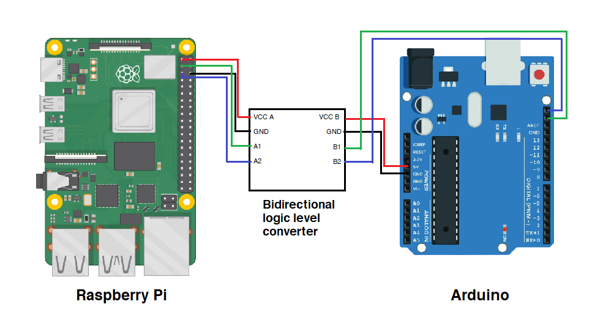

# CatBot Communications Test
This repository contains a possible implementation for communication between CatBot's two control boards - a Raspberry Pi as the "brain" and an Arduino to handle analog inputs. This implementation uses I2C to send data bidirectionally.

A Raspberry Pi 4B and an Arduino Leonardo were used for testing.

## Hardware setup

The Pi and Arduino do logic at differerent voltages, 3.3V and 5V respectively. A direct connection between the two is fine if you only send data from the Pi to the Arduino, but a bidirectional logic level converter is necessary if data is being transferred the other way (otherwise you risk damaging the Pi). The connections are as follows:

| Line | Rasberry Pi | Converter | Arduino |
|------|-------------|-----------|---------|
| VCC | 3v3 power (pin 1) | VCC-A / VCC-B | 5V power |
| SDA (data) | GPIO 2 (pin 3) | A1 / B1 | SDA (above AREF pin)
| SCL (clock) | GPIO 3 (pin 5) | A2 / B2 | SCL (above SDA pin)

Both devices are powered separately, and make sure to tie both devices to ground.

## Software

#### Overview

> (see _comms\_demo_ directory)

Specific parts of code are commented to explain what each section does, but here is an overview of how the communication works:
* The Pi detects the Arduino as an I2C device, in this case with the address `0x0A`.
* When the Pi needs data from the Arduino, it uses the SMBus Python module to attempt to read some number of bytes from the I2C bus. When it does this, it also sends a single byte to the Arduino that represents the type of data it needs.
* The Arduino detects that the Pi just did this, and it constructs a "packet" with the necessary data to send back.
* It sends the data to the Pi (using the Wire library) as an array of bytes, and the Pi can then use that data however it needs to.

#### Packet structure

The Arduino's `Packet` class formats the data before sending it to the Pi. This is an abstraction that I've written so that the Arduino will always send data in the same format; the actual sending of data can be achieved with a call to [`Wire.write()`](https://reference.arduino.cc/reference/en/language/functions/communication/wire/write/).

`Packet` sends data in the following format:

**Packet type (bits 0-3):** This is, ideally, a bit of futureproofing. In my example, packet type 1 contains potentiometer, limit switch, and air pressure readings, but more packet types can be added later on to contain other types of data that the Arduino may need to transmit. Having each packet labeled with its type also helps in the event that the Pi makes several different types of requests at once, but can't guarantee that they'll return in a given order (for example, with threading).

**Data length (bits 4-7):** Represents the length of the **Data** section, in bytes. The Pi doesn't know how large a response packet might be, so it uses this section as a reference for that. I2C does not have a hard limit to how much data can be sent at once, but for compactness I've made this section 4 bits (for a maximum of 15 bytes of actual data).

**Data:** Contains the actual information that the Arduino is sending to the Pi.

## Threading test

> (see _thread\_test_ directory)

I've added a small, simple test that demonstrates a multithreaded approach on the Python side. The main thread updates a constantly-changing value received from the Arduino, and a second thread is created to print that value after pressing Enter. In reality, this second thread would be used to perform necessary operations on the received value.

This method seems to work okay with the timings I'm using currently. However, making the delay shorter between I2C reads increases the chance of Python throwing `OSError: [Errno 121] Remote I/O error`. It might take some trial-and-error to get the timings between the Pi and Arduino right - short enough where data flows as quickly as we need it to, but long enough where this error doesn't come up.

## Further reading

* [Arduino Wire Documentation](https://reference.arduino.cc/reference/en/language/functions/communication/wire/)
* [SMBus2 documentation](https://smbus2.readthedocs.io/en/latest/index.html)
* [Helpful video I used to get started](https://www.youtube.com/watch?v=me7mhrRbspk&ab_channel=DroneBotWorkshop)